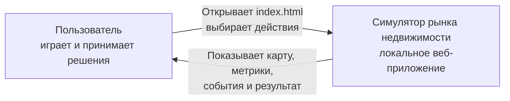
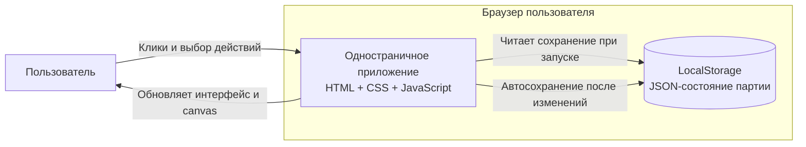
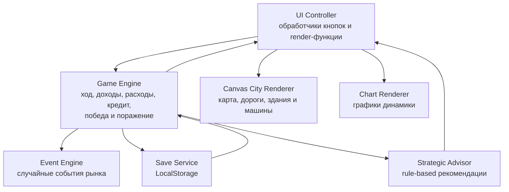
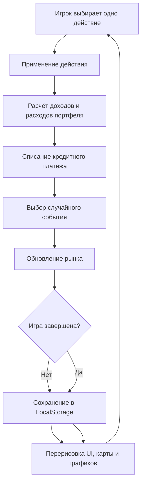

# Симулятор рынка недвижимости

> Учебная экономическая стратегия в браузере: стройте городской портфель, реагируйте на рынок и доведите инвестиционную компанию до победы за 20 кварталов.

Проект работает полностью локально. Не нужен сервер, установка зависимостей или регистрация: достаточно открыть [`app/index.html`](app/index.html) в браузере.

---

# Часть 1. Для пользователя

## Почему стоит попробовать

Это не таблица с числами и не набор бессвязных кнопок. Перед игроком находится компактный инвестиционный симулятор: каждое решение меняет капитал, репутацию и состояние рынка, а построенные объекты появляются на процедурной городской карте.

В одной партии нужно найти баланс между ростом и безопасностью:

- строить новые объекты, но не остаться без денежного резерва
- улучшать здания, чтобы повышать доход и репутацию
- учитывать спрос и процентную ставку
- использовать кредит только тогда, когда он действительно помогает развитию
- переживать хорошие и плохие события рынка
- не пытаться заработать простой перепродажей активов

Одна партия занимает немного времени, но требует осмысленных решений. Игра подходит для демонстрации базовых экономических связей: стоимость денег, доходность активов, рыночный спрос, репутационные риски и управление портфелем.

## Быстрый запуск

1. Скачайте или откройте папку проекта.
2. Перейдите в папку `app`.
3. Откройте файл `index.html` двойным кликом.
4. Нажмите кнопку **«Начать новую игру»**.

```text
app/index.html
```

Приложение работает без интернета. Прогресс текущей партии автоматически хранится в браузере.

## Цель игры

У вас есть 20 кварталов, чтобы превратить стартовый капитал в устойчивый портфель недвижимости.

Для победы к окончанию 20 квартала необходимо одновременно выполнить все условия:

| Условие | Требование |
| --- | ---: |
| Капитал | больше `2 000 000` |
| Репутация | не ниже `60 / 100` |
| Активные объекты | минимум `4` |
| Суммарная прибыль после платежей | минимум `700 000` |
| Улучшенные активные объекты | минимум `2` |
| Кредит | полностью погашен |

Если деньги опустятся ниже нуля, наступает поражение. Если игрок дойдёт до финала, но не выполнит все требования, игра покажет нейтральный итог.

## Что находится на игровом экране

Основной экран организован так, чтобы игрок сразу видел и действие, и его последствия.

| Область | Что показывает |
| --- | --- |
| Верхняя панель | квартал, деньги, репутацию, спрос, ставку и суммарную прибыль |
| Левая панель | доступные действия, выбранный объект, кредит, пропуск хода и советчик |
| Карта справа | городской район, участки, дороги, здания и движение машин |
| Нижние блоки | карточки объектов, события, краткую сводку и графики динамики |

Карта не использует скачанные модели. Город рисуется самим приложением на `canvas`: тип здания и его уровень влияют на внешний вид объекта.

## Доступные действия

За один квартал можно выполнить только одно действие. После него квартал сразу завершается.

| Действие | Что происходит |
| --- | --- |
| Построить жильё | создаётся доступный и стабильный объект стоимостью `250 000` |
| Построить офис | создаётся дорогой объект с высоким потенциальным доходом стоимостью `400 000` |
| Построить ритейл | создаётся сбалансированный коммерческий объект стоимостью `320 000` |
| Улучшить объект | списывается `80 000`, уровень здания растёт на `1`, репутация увеличивается на `3` |
| Продать объект | актив превращается в деньги, но ранняя продажа и комиссия снижают выгоду |
| Взять кредит | игрок получает `300 000`, после чего 8 кварталов выплачивает проценты |
| Пропустить ход | новые вложения не совершаются, но квартал всё равно обрабатывается |

## Как проходит квартал

После каждого решения игра автоматически выполняет полный цикл:

1. Применяет выбранное действие.
2. Начисляет доходы и расходы всех активных объектов.
3. Списывает кредитный платёж, если кредит активен.
4. Генерирует случайное рыночное событие.
5. Обновляет спрос, ставку, репутацию и деньги.
6. Увеличивает номер квартала.
7. Сохраняет текущее состояние.
8. Перерисовывает интерфейс и карту.

## Объекты недвижимости

| Тип | Стоимость | Базовый доход | Базовый расход | Роль в стратегии |
| --- | ---: | ---: | ---: | --- |
| Жильё | `250 000` | `45 000` | `12 000` | безопасный старт и постепенное расширение |
| Офис | `400 000` | `70 000` | `22 000` | высокий доход при достаточном запасе денег |
| Ритейл | `320 000` | `60 000` | `18 000` | компромисс между стоимостью и доходностью |

Фактический доход зависит не только от типа здания. На него влияют спрос, репутация компании и уровень улучшения объекта.

## Рыночные события

Каждый квартал рынок меняется. Событие может помочь стратегии или заставить срочно пересмотреть план.

В игре реализовано 14 событий:

- рост интереса к жилью
- спад потребительской активности
- снижение процентной ставки
- рост ставки
- государственная поддержка
- проверка объекта
- удачная PR-кампания
- инфляционное давление
- ремонт инфраструктуры
- рост затрат на обслуживание
- приток бизнеса в район
- сокращение спроса на коммерческие площади
- льготное кредитование
- локальный городской фестиваль

История последних пяти событий остаётся на экране. Денежные эффекты масштабируются от размера активного портфеля: нельзя получить бесплатную победу, просто пропуская все ходы.

## Советчик

Если вы не уверены в следующем решении, включите режим подсказок. Советчик анализирует состояние партии и предлагает конкретное действие:

- построить определённый тип объекта
- улучшить выбранное здание
- взять кредит
- продать лишний актив
- временно пропустить ход

Советчик не играет вместо пользователя и не нарушает правила. Он объясняет причину рекомендации, показывает риски и помогает понять экономическую логику симулятора.

## Первые шаги

Для первой партии можно использовать простой ориентир:

1. Начните с жилья или ритейла, чтобы получить первый денежный поток.
2. Не тратьте весь капитал: плохое событие может потребовать резерва.
3. Развивайте разные объекты, а не улучшайте только одно здание.
4. Следите за репутацией: без неё доходы снижаются, а победа невозможна.
5. Берите кредит только если успеете погасить его до конца 20 квартала.
6. Не перепродавайте здания сразу после покупки: ранняя продажа невыгодна.

## Сохранение прогресса

Текущая партия автоматически сохраняется в `LocalStorage` браузера. Доступны:

- автосохранение после кварталов и ключевых действий
- восстановление состояния после повторного открытия страницы
- кнопка **«Новая игра»**
- кнопка **«Сбросить прогресс»**

Отдельной кнопки продолжения на стартовом экране нет: интерфейс намеренно оставлен компактным.

---

# Часть 2. Для разработчика

## Назначение проекта

Проект демонстрирует реализацию небольшой браузерной игры без серверной части и сторонних зависимостей. Основная логика, визуализация и хранение данных находятся на стороне клиента.

Технические ограничения:

- только HTML, CSS и JavaScript
- без React и TypeScript
- без backend и базы данных
- без npm-зависимостей
- без сборщиков
- запуск через локальный файл `app/index.html`

## Стек

| Технология | Назначение |
| --- | --- |
| HTML5 | структура стартового, игрового и модальных экранов |
| CSS3 | адаптивная компоновка, карточки, панели и состояния интерфейса |
| JavaScript | игровая логика, события, советчик, рендеринг и сохранение |
| Canvas API | процедурная 2.5D-карта и графики |
| LocalStorage | локальное сохранение состояния партии |

## Структура файлов

```text
.
├── README.md
├── LLMconsult.md
└── app
    ├── index.html
    ├── style.css
    └── script.js
```

| Файл | Ответственность |
| --- | --- |
| `app/index.html` | статическая разметка экранов, панелей, кнопок и модальных окон |
| `app/style.css` | визуальная система, адаптивность и оформление компонентов |
| `app/script.js` | все данные, формулы, игровой цикл, UI-рендеринг, карта, советчик и LocalStorage |
| `LLMconsult.md` | журнал консультаций с LLM по этапам разработки |

## Архитектура в нотации C4

Для документации используются первые уровни C4: контекст системы, контейнеры и компоненты. В официальном описании C4 эти уровни используются как последовательное приближение: от общей картины к внутреннему устройству приложения.

### Уровень 1. System Context

Пользователь взаимодействует только с браузерным симулятором. Внешних серверов, API и баз данных нет.



### Уровень 2. Container Diagram

В терминах C4 клиентское одностраничное приложение является контейнером, а `LocalStorage` выступает локальным хранилищем данных.



### Уровень 3. Component Diagram

Внутри браузерного приложения логика разделена на функциональные компоненты. Физически они находятся в одном файле `script.js`, но отвечают за разные части системы.



## Модель состояния

Основное состояние игры хранится в объекте `state` и сериализуется в JSON.

Ключевые поля:

| Поле | Назначение |
| --- | --- |
| `money` | текущий капитал |
| `reputation` | репутация от 0 до 100 |
| `demand` | рыночный спрос от 0 до 100 |
| `interestRate` | процентная ставка |
| `quarter` | текущий квартал |
| `totalProfit` | накопленная прибыль после платежей |
| `properties` | список построенных и проданных объектов |
| `loan` | состояние кредита |
| `lastEvent` | последнее событие |
| `eventHistory` | последние события |
| `timeline` | история значений для графиков |
| `ui` | настройки интерфейса, включая режим подсказок |

Каждый объект недвижимости содержит:

| Поле | Назначение |
| --- | --- |
| `id` | уникальный идентификатор |
| `typeKey` | внутренний тип: `housing`, `office` или `retail` |
| `type` | отображаемое название типа |
| `name` | название объекта |
| `baseCost` | базовая стоимость строительства |
| `baseIncome` | базовый доход |
| `baseExpense` | базовый расход |
| `level` | уровень улучшения |
| `status` | `active` или `sold` |
| `createdAtQuarter` | квартал строительства |
| `soldAtQuarter` | квартал продажи |
| `soldPrice` | фактическая цена продажи |

## Игровой цикл



## Экономические формулы

Доход объекта:

```text
income = baseIncome
  * (0.5 + demand / 200)
  * (0.7 + reputation / 200)
  * levelMultiplier
```

Множитель уровня:

```text
levelMultiplier = 1 + (level - 1) * 0.15
```

Расход объекта:

```text
expense = baseExpense * (1 + interestRate / 1000)
```

Чистый доход:

```text
netIncome = income - expense
```

Цена продажи:

```text
salePrice = baseCost
  * (0.72 + demand / 250)
  * (1 + (level - 1) * 0.08)
  * holdingMultiplier
  * 0.92
```

Где:

- `holdingMultiplier = 1`, если объект удерживался минимум 4 квартала
- `holdingMultiplier = 0.86`, если объект продаётся раньше
- `0.92` означает вычет комиссии и транзакционных потерь в размере 8%

Кредитный платёж:

```text
loanPayment = 300000 * (interestRate / 100) / 8
```

## События рынка

События находятся в массиве `EVENT_POOL`. Каждое событие содержит:

```text
title
description
category
effect: {
  demand,
  interestRate,
  reputation,
  money
}
```

После выбора события его эффект применяется к состоянию рынка. Денежная часть дополнительно масштабируется функцией `getEventMoneyExposure()`: чем меньше активный портфель, тем слабее прямой денежный эффект. При отсутствии объектов прямой денежный эффект равен нулю.

## Советчик

Советчик реализован как rule-based алгоритм в функции `getStrategicAdvice()`. Это последовательность правил с приоритетами, а не машинное обучение.

Он учитывает:

- оставшееся количество ходов
- текущий капитал
- активный кредит и срок погашения
- число активных объектов
- число улучшенных активных объектов
- разнообразие типов недвижимости
- ожидаемый денежный поток
- темп накопления прибыли
- резерв денег
- репутационный запас
- последнее событие

Советчик может предложить строительство, улучшение, продажу, кредит или пропуск хода. Функция `performRecommendedAction()` передаёт выбранное действие в стандартные игровые функции. Благодаря этому советчик соблюдает те же ограничения, что и пользователь.

## Canvas-карта

Карта реализована процедурно без внешних ассетов:

- `renderCityScene()` подготавливает данные сцены
- `drawCityFrame()` запускает отрисовку кадра
- `drawCityTiles()` рисует изометрическую сетку участков
- `drawRoadTile()` и вспомогательные функции формируют связанную дорожную сеть
- `drawBuilding()` рисует здания разных типов
- `drawCar()` отображает машины на заранее заданных маршрутах
- обработчик движения мыши показывает tooltip участка

Здания визуально различаются:

| Тип | Особенности |
| --- | --- |
| Жильё | зелёная палитра, дополнительное крыло, балконы и деревья |
| Офис | синяя палитра, стеклянный фасад, оборудование на крыше и антенна |
| Ритейл | тёплая палитра, низкий корпус, витрина и вывеска |

Уровень объекта влияет на высоту здания. У новых объектов временно отображается строительная деталь.

## LocalStorage

Сохранение реализовано через ключ:

```text
real-estate-simulator-save-v1
```

Основные операции:

- `saveGame()` сериализует `state`
- `loadGame()` восстанавливает сохранение
- `clearSavedGame()` удаляет прогресс
- `normalizeLoadedState()` дополняет старые сохранения актуальными полями

## Проверка проекта

Для базовой проверки JavaScript можно выполнить:

```bash
node --check app/script.js
```

Проверка пробельных ошибок в изменениях:

```bash
git diff --check
```
